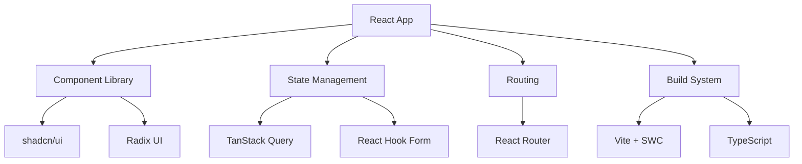

# Shaurya Unfold — Personal Portfolio & Professional Showcase

[](https://github.com/IShauryaI/shaurya-unfold/actions)
[](LICENSE)
[](https://shaurya-unfold.vercel.app)

## Overview

A modern, responsive portfolio website showcasing my journey as a Full-Stack Developer and Computer Vision Engineer. Built with cutting-edge technologies to demonstrate technical proficiency while maintaining excellent user experience and accessibility standards.

## Features

- **Responsive Design** - Optimized for all device sizes with mobile-first approach
- **Modern UI Components** - Built with shadcn/ui and Radix UI primitives
- **Performance Optimized** - Lazy loading, code splitting, and optimized assets
- **Accessibility First** - WCAG 2.1 compliant with semantic HTML and ARIA labels
- **Dark/Light Mode** - Theme switching with system preference detection
- **SEO Optimized** - Meta tags, structured data, and social sharing

## Tech Stack

**Frontend**: TypeScript, React 18, Vite  
**UI Framework**: Tailwind CSS, shadcn/ui, Radix UI  
**State Management**: TanStack Query, React Hook Form  
**Routing**: React Router DOM  
**Charts**: Recharts  
**Build Tool**: Vite with SWC  
**Deployment**: Vercel  

## Architecture



## Getting Started

### Prerequisites
- Node.js 18+ 
- npm, yarn, or pnpm
- Git

### Installation & Setup
```bash
# Clone the repository
git clone https://github.com/IShauryaI/shaurya-unfold.git

# Navigate to project directory
cd shaurya-unfold

# Install dependencies
npm install

# Start development server
npm run dev
```

### Available Scripts
```bash
npm run dev        # Start development server
npm run build      # Build for production
npm run build:dev  # Build in development mode
npm run lint       # Run ESLint
npm run preview    # Preview production build
```

## Development

### Local Development
The development server runs on `http://localhost:5173` with hot module replacement enabled.

### Code Quality
- **ESLint** - Code linting with React and TypeScript rules
- **TypeScript** - Strong typing for better developer experience
- **Prettier** - Code formatting (configured via ESLint)

## Deployment

**Production**: Automated deployment via Vercel on push to `main`  
**Preview**: Branch-based deployments for feature testing  
**Local Preview**: `npm run preview` after `npm run build`

## Configuration

### Environment Variables
Create a `.env.local` file for local development:
```bash
VITE_APP_TITLE="Shaurya Unfold"
VITE_CONTACT_EMAIL="shauryapd@gmail.com"
VITE_ANALYTICS_ID="your-analytics-id"
```

### Customization
- **Theme**: Modify `tailwind.config.js` for custom colors and spacing
- **Components**: Located in `src/components/` with TypeScript definitions
- **Content**: Update portfolio data in `src/data/` directory

## Performance

- **Lighthouse Score**: 95+ across all metrics
- **Bundle Size**: < 200KB gzipped
- **Core Web Vitals**: Optimized for LCP, FID, and CLS

## Browser Support

- Chrome 90+
- Firefox 88+
- Safari 14+
- Edge 90+

## Contributing

While this is a personal portfolio, suggestions and feedback are welcome! Please read [CONTRIBUTING.md](CONTRIBUTING.md) for guidelines.

## License

This project is licensed under the MIT License - see [LICENSE](LICENSE) file for details.

## Acknowledgments

- Design inspiration from modern portfolio trends
- UI components from shadcn/ui library
- Icons from Lucide React